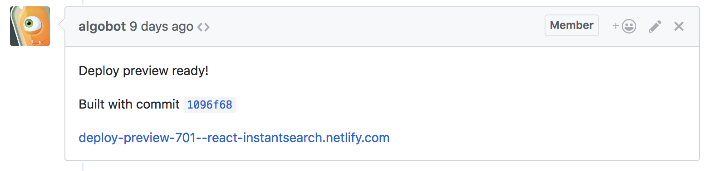

# community-project-boilerplate

<!-- START doctoc generated TOC please keep comment here to allow auto update -->
<!-- DON'T EDIT THIS SECTION, INSTEAD RE-RUN doctoc TO UPDATE -->
**Table of Contents**  *generated with [DocToc](https://github.com/thlorenz/doctoc)*

- [What is it](#what-is-it)
- [Requirements](#requirements)
- [Initial setup](#initial-setup)
- [Publish docs to https://community.algolia.com/my-project](#publish-docs-to-httpscommunityalgoliacommy-project)
- [Local development](#local-development)
- [Test build](#test-build)
- [Changes to be done before going live](#changes-to-be-done-before-going-live)
- [Project structure](#project-structure)
- [Assets and links references](#assets-and-links-references)
- [Deploy previews](#deploy-previews)
- [Contributing](#contributing)

<!-- END doctoc generated TOC please keep comment here to allow auto update -->

## What is it

A simple community boilerplate to replicate Algolia websites like InstantSearch*.

## Requirements

To run this project, you will need:

- Node.js >= v9.2.0, use nvm - [install instructions](https://github.com/creationix/nvm#install-script)
- Yarn >= v1.3.2 - [install instructions](https://yarnpkg.com/en/docs/install#alternatives-tab)

## Initial setup

```sh
git clone git@github.com:algolia/community-project-boilerplate.git my-project
cd my-project
nvm use
rm -rf .git
git init
git remote add origin git@github.com:algolia/my-project.git
yarn
yarn docs:update
git add docs README.md CONTRIBUTING.md
git commit -m 'first commit'
git push
```

## Publish docs to https://community.algolia.com/my-project

You need to activate GitHub pages for your repository (in settings on GitHub), choose "master branch /docs folder".

Every time you want to update your production website, do:

```sh
yarn docs:update
git add docs README.md CONTRIBUTING.md
git commit -m 'docs(update): something'
git push
```

At some point this will be moved to Netlify.

## Local development

```sh
yarn
yarn start
```

Go to https://localhost:3000. There should be auto reload for almost everything, but when it fails just restart the server.

## Test build

This will run the build of the website and serve it. Useful when you are modifying production middlewares and want to ensure
the resulting website will be working. Like when adding CSS minification.

```sh
yarn docs:test-build
```

## Changes to be done before going live

- Rename any folder and replace any occurence of `community-project-boilerplate` to `my-project`.
- Remove `meta(name='ROBOTS', content='NOINDEX, NOFOLLOW')` from [src/community-project-boilerplate-docgen/layouts/common/meta.pug](./src/community-project-boilerplate-docgen/layouts/common/meta.pug).

## Project structure

- Pages (index, about..) are in [src/community-project-boilerplate-docgen/src](./src/community-project-boilerplate-docgen/src)
- Layouts are in [src/community-project-boilerplate-docgen/layouts](./src/community-project-boilerplate-docgen/layouts)
- JS and images are in [src/community-project-boilerplate-docgen/assets](./src/community-project-boilerplate-docgen/assets)
- Stylesheets are in [src/community-project-boilerplate-docgen/src/stylesheets](./src/community-project-boilerplate-docgen/src/stylesheets)

## Assets and links references

To reference assets and links from any HTML page in this website, always reference them from the root of the website, without any leading "." or "/". Links from HTML pages are always relative to the root of your website, not the current file.

To ease hosting on different subpaths (https://community.algolia.com/website/ and http://localhost:3000/), we use a [`<base href>`](https://developer.mozilla.org/en-US/docs/Web/HTML/Element/base) tag that allow us to easily achieve that.

If your image is in `assets/images/image.png` then you can reference it in your HTML page like that: `` and it will always work no matter how the website is hosted.

Same for linking to a particular page, if you are in `index.html` (or `index.md`), to link to `about/team.html` just do this: `<a href="about/team.html">team</a>`.

For ressources inside CSS files, always use relative paths from the CSS file itself like `background-image: url("../assets/image/image.png")`);

## Deploy previews

.

If you want to have deploy previews, which are live deployments of your website
from pull requests submitted to this repository, please:
- Go to https://www.netlify.com/
- Login with GitHub
- Add "New site from Git"
- Leave everything by default
- Go to your Netlify project, click on Deploys > Notifications
- Open a new tab Login to GitHub on a bot like account (algobot for Algolia)
- Return to Netlify, add a notification as a GitHub comment
- Choose "Deploy succeeded"
- Click on "generate access token in GitHub"

Now the bot you logged in will generate a dedicated token for this project and will be the author of the comments when something new is deployed.

You can now logout from GitHub and login again with your real account.

## Contributing

See [CONTRIBUTING](./CONTRIBUTING.md).

